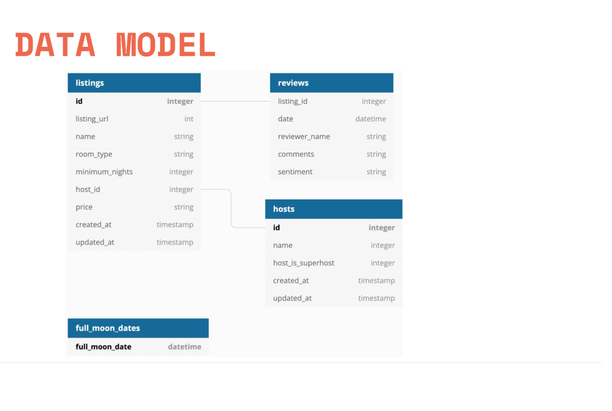

# Airbnb Analytics Pipeline Project

## 1. Project Structure
- **Data Warehouse**: Snowflake (Postgres if you use local-setup folder).
- **Data Modeling**: dbt (data build tool) for transformation and modeling.
- **Orchestration**: Dagster for workflow automation.
- **Visualization**: Power BI for data visualization.

## 2. Project Purpose
The goal of this project is to build an automated pipeline that processes raw data from Airbnb and transforms it into structured data for analysis. The final objective is to generate business insights through Power BI dashboards, orchestrated by Dagster and transformed by dbt.

## 3. Data Used
- **Source Data**: Data sourced from Airbnb with the structure as below.
  


If you use local-setup, you need to download data (hosts.csv, listings.csv, reviews.csv) from S3 buckets of s3://dbtlearn.

## 4. Project Flow

### General Flow
1. **Data Extraction**: Data is extracted from the source system.
2. **Transformation**: Data is transformed using dbt, where raw data is cleaned and modeled into usable structures (e.g., dimension and fact tables).
3. **Orchestration**: Dagster is used to automate the running of dbt jobs, ensuring that the data pipeline runs efficiently and on schedule.
4. **Visualization**: Power BI connects to Snowflake, allowing users to visualize the transformed data in the form of interactive dashboards.

### dbt Flow
- **Seed Data**: Load CSV files into Snowflake using `dbt seed`.
- **Source & Ref**: Define the source of the raw data and use `ref()` for dependency management and `source()` for base tables.
- **Modeling**: Create dbt models for the transformation of the raw data into dimensions (`dim`) and fact tables (`fct`).
- **Snapshots**: Handle Slowly Changing Dimensions (SCD Type 2) using dbt snapshot functionality.
- **Testing**: Define tests for data quality in the schema.yml file or create custom tests in the `tests` folder.
- **Documentation**: Use dbt’s documentation functionality to auto-generate project documentation.


### Dagster Flow
- **Scaffold the Project**: Use Dagster-Dbt integration to scaffold a Dagster pipeline for orchestrating dbt runs.
- **Run the Pipeline**: Schedule and manage the pipeline’s execution to ensure that the data transformation jobs run on time.

## 5. Final Output (Optional)
- **Power BI Dashboards**: Once the data is processed and transformed, Power BI connects to the Snowflake data warehouse to create visual dashboards.

## 6. Steps to Reproduce the Project

### Install Dependencies
```bash
pip install dbt-core dbt-snowflake dbt-postgres dagster dagster-dbt dagster-webserver
```

### Set up dbt
Run the command to initialize the dbt project:
```bash
dbt init airbnb
# Select Snowflake as the database.
# Enter your Snowflake account details: account, user, password, role, warehouse, db, schema.
```

Check dbt Setup

```bash
cd airbnb
dbt debug
```

### Copy Project Files into the dbt Folder
- Note: You cannot run dbt unless it is initialized on your local machine. The files and folders in the airbnb directory provided here are for reference only. You need to manually copy the contents of these folders into your dbt folder.

Steps:

- Open the airbnb folder.

- Copy the following files and folders:
    - models/ folder (for dbt models)
    - seeds/ folder (for CSV seed files)
    - snapshots/ folder (for snapshots)
    - tests/ folder (for custom tests)
    - macros/ folder (for custom dbt functions)

- Paste these files into the corresponding directories in your local dbt project.

### Set up dbt Extensions

- Download the `power user for dbt` extension to ease interaction with dbt (you can download directly from VSCode extension or dbt-ext.sh attached in the project).

- Find `open user settings` (can be accessed through Ctrl+Shift+P), then modify the json settings file to include:
```
"files.associations": {
    "*.sql": "jinja-sql",
    "*.yml": "yaml"
}
```

### dbt Data Modeling

- Use ref() for model dependencies and source() for raw data.

- Seed CSV data using dbt seed.

- Data Quality Checks

  - Define tests in schema.yml and run dbt test.
    
  - Create custom tests in the tests folder and run them with dbt test.
    
  - You can also define generic test in macros folder.

- Install extension packages by creating packages.yml under airbnb project folder and running `dbt deps`.

```bash
# Packages.yml
packages:
  - package: dbt-labs/dbt_utils
    version: 1.3.0
  - package: calogica/dbt_expectations
    version: 0.10.4
```

- Run dbt using `dbt run`.
  
- Documentation
    
  - Add descriptions and generate docs with `dbt docs generate`.
    
  - Serve docs with `dbt docs serve`.

- Data Loading to Power BI
    
  - Create a role in Snowflake and grant necessary access (following scripts in `power-bi-connect.sql`).

  - Configure the dbt project to allow Power BI access by modifying dbt_project.yml.

  - Connect Power BI to Snowflake using the account URL and credentials.

- Dagster Orchestration
    
  - Scaffold the Dagster project:

```bash
dagster-dbt project scaffold --project-name airbnb_dagster --dbt-project-dir airbnb
```

  - Then copy profiles.yml into the airbnb folder and run the Dagster development server:
  
```bash
dagster dev
```

By following these steps, you can set up an automated pipeline that extracts, transforms, and loads data into Snowflake, and visualize the results in Power BI.

